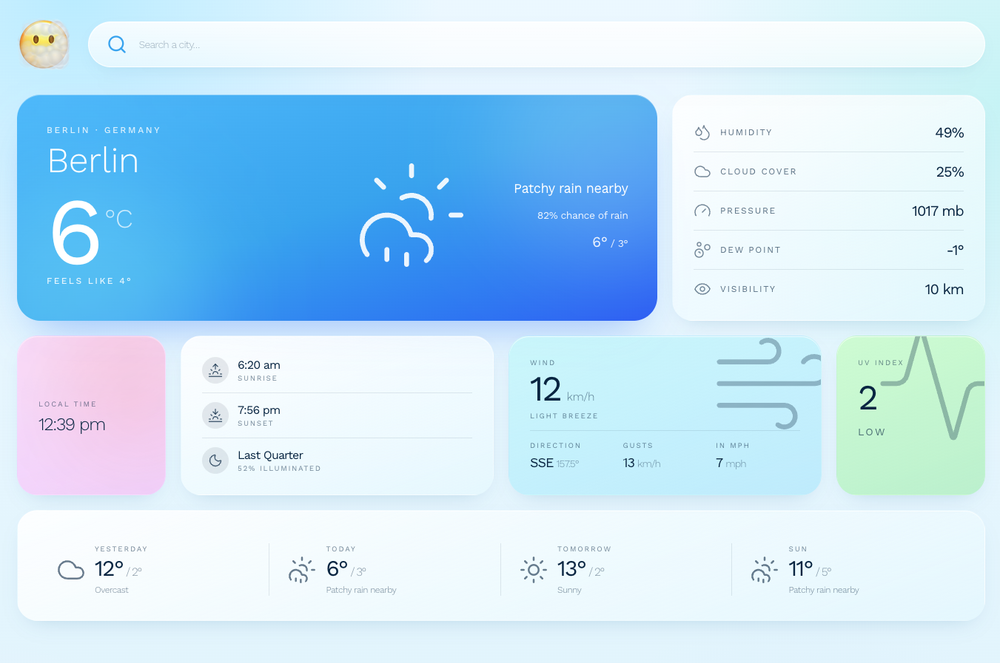
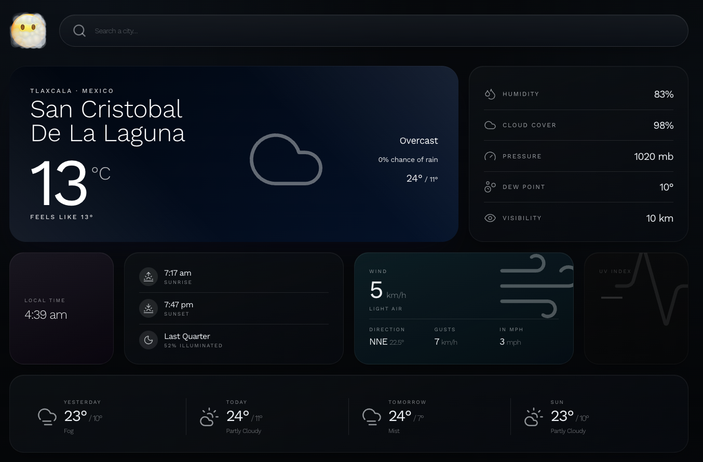

# air

A small, fast weather forecast app. Search any city, see today's conditions and forecast.

**Live demo:** air.hi-133.workers.dev/

The demo runs on a free WeatherAPI tier with edge caching, which keeps it
within quota under reasonable load. If the quota is exhausted, the app
degrades to a friendly explanatory state instead of an error page.





## Quick start

Prerequisites: **Node 22+** (tested on 22 and 24), **pnpm 10**.

```bash
pnpm install
pnpm dev
```

The dev server runs Vite + the Cloudflare Worker together. The app is available at the URL Vite prints; `/api/*` is handled by the Worker locally.

To run against the real upstream API with your own key, see [Local API key](./docs/deployment.md#local-api-key).

## Docs

- **[Architecture](./docs/architecture.md)** — module layout, stack, key design choices
- **[Testing](./docs/testing.md)** — what's covered and why
- **[Deployment](./docs/deployment.md)** — CF Worker deploy, CI, scripts
- **[RFCs](./docs/rfcs/)** — design proposals
- **[Decisions](./docs/decisions/)** — short ADRs for one-off calls

## License

MIT.
